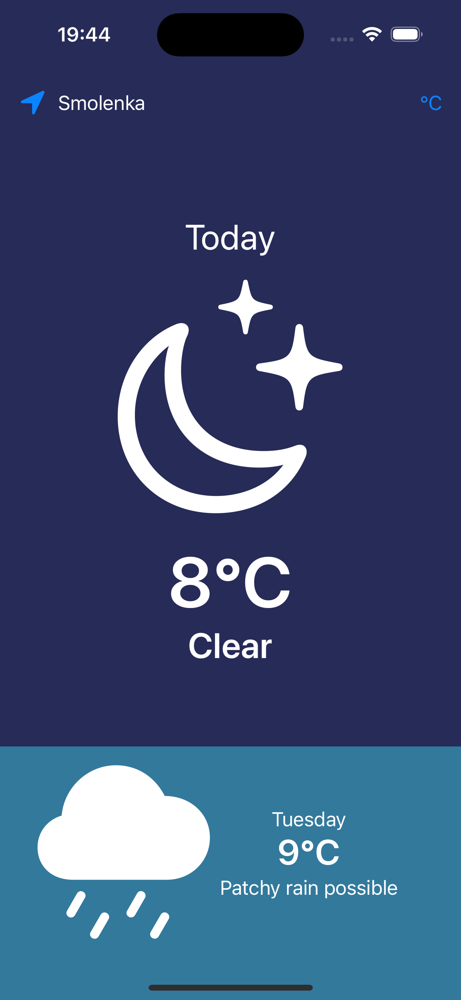
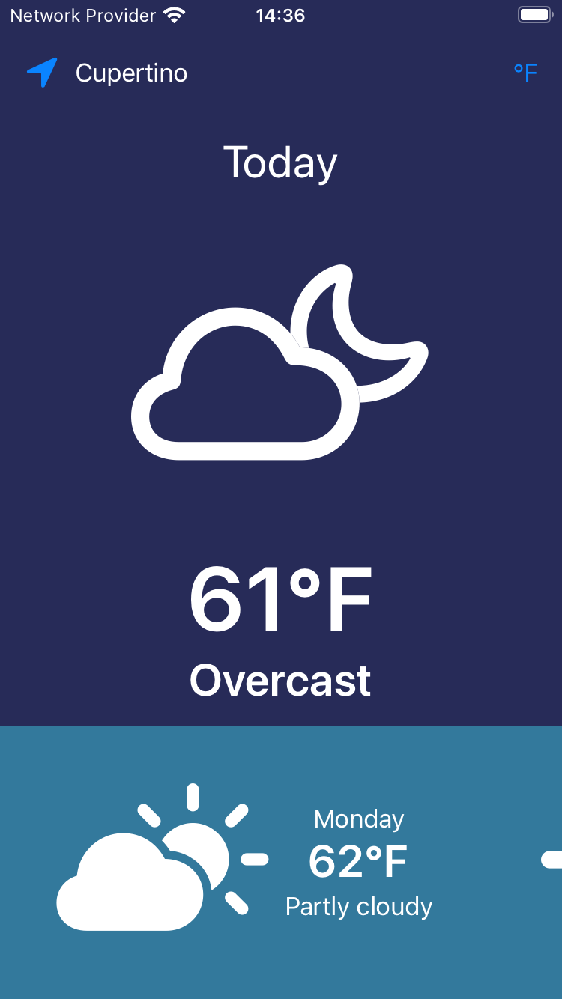

# myWeatherForecast
App shows the user current weather and three day forecast fetching data from weather API

The app uses CoreLocation(framework provided by Apple) to determine a device’s geographic location, fetches data from both local JSONs and free weather API (https://www.weatherapi.com) via http request.

App UI design is light and simple.

Link to app presentation on youtube: https://youtu.be/5ia5wq5RmFQ

The design looks well both on smaller (here iPhoneSE 3rd gen.) and bigger (here iPhone 15 Pro) devices.

